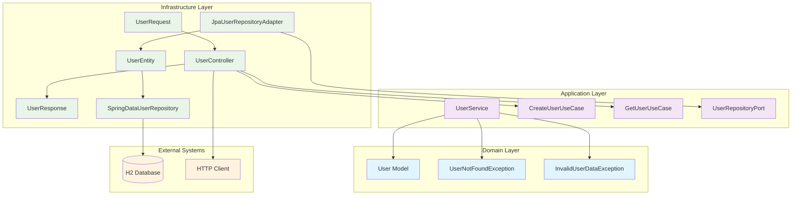

# Hexagonal Architecture Java Application

## Overview

This is a proof of concept application demonstrating the implementation of **Hexagonal Architecture** (also known as Ports and Adapters) in Java using Spring Boot. The application provides basic user management functionality with clear separation of concerns across different architectural layers.

## Purpose

This project serves as a learning example to showcase:
- Hexagonal Architecture principles and implementation
- Clean separation between business logic and infrastructure concerns
- Proper dependency inversion and inversion of control
- Domain-driven design patterns

**Note**: This is a simplified proof of concept focused primarily on architectural patterns rather than being a complete production-ready application.

## Architecture Overview

The application follows Hexagonal Architecture principles with three main layers:

### Domain Layer (Core Business Logic)
- **Models**: `User` entity with business rules and validation
- **Exceptions**: Domain-specific exceptions (`UserNotFoundException`, `InvalidUserDataException`)
- **Business Rules**: Encapsulated within the domain model

### Application Layer (Use Cases)
- **Ports (Interfaces)**:
  - Input Ports: `CreateUserUseCase`, `GetUserUseCase`
  - Output Ports: `UserRepositoryPort`
- **Services**: `UserService` implementing use cases and orchestrating business logic

### Infrastructure Layer (External Concerns)
- **Controllers**: REST API endpoints (`UserController`)
- **Persistence**: JPA entities and repository adapters (`UserEntity`, `JpaUserRepositoryAdapter`)
- **DTOs**: Request/Response objects for API communication

## Architecture Diagram



## Project Structure

```
src/main/java/com/lagm/ah/arquitecturahexagonaljava/
├── application/
│   ├── port/
│   │   ├── in/                    # Input ports (use cases)
│   │   │   ├── CreateUserUseCase.java
│   │   │   └── GetUserUseCase.java
│   │   └── out/                   # Output ports (repositories)
│   │       └── UserRepositoryPort.java
│   └── service/
│       └── UserService.java       # Application service
├── domain/
│   ├── exception/
│   │   ├── InvalidUserDataException.java
│   │   └── UserNotFoundException.java
│   └── model/
│       └── User.java              # Domain entity with business rules
└── infrastructure/
    ├── controller/
    │   └── dto/
    │       ├── UserController.java
    │       ├── UserRequest.java
    │       └── UserResponse.java
    └── persistence/
        ├── JpaUserRepositoryAdapter.java
        ├── SpringDataUserRepository.java
        └── UserEntity.java
```

## Key Features

### Domain-Driven Design
- **User Model**: Contains business validation rules (non-null names)
- **Domain Exceptions**: Specific exceptions for business rule violations
- **Encapsulation**: Business logic is contained within the domain layer

### Dependency Inversion
- **Ports**: Define contracts between layers
- **Adapters**: Implement ports in the infrastructure layer
- **Dependency Flow**: Infrastructure depends on Application, Application depends on Domain

### Error Handling
- **Domain Exceptions**: Business-specific exceptions defined in the domain
- **Application Orchestration**: Use case services handle exception orchestration
- **Infrastructure Delegation**: Controllers delegate error handling to application layer

## API Endpoints

### Create User
```
POST /users
Content-Type: application/json

{
  "firstName": "John",
  "lastName": "Doe"
}
```

### Get User by ID
```
GET /users/{id}
```

## Technology Stack

- **Java 17**
- **Spring Boot 3.5.7**
- **Spring Data JPA**
- **H2 Database** (in-memory for testing)
- **Maven** (dependency management)

## Getting Started

### Prerequisites
- Java 17 or higher
- Maven 3.6 or higher

### Running the Application

1. Clone the repository
2. Navigate to the project directory
3. Run the application:
   ```bash
   mvn spring-boot:run
   ```

4. The application will start on `http://localhost:8080`

### Testing

Run the test suite:
```bash
mvn test
```

## Architecture Benefits Demonstrated

1. **Testability**: Each layer can be tested independently
2. **Maintainability**: Clear separation of concerns makes code easier to maintain
3. **Flexibility**: Infrastructure can be swapped without affecting business logic
4. **Scalability**: New use cases can be added without modifying existing code
5. **Independence**: Business logic is independent of external frameworks

## Design Patterns Used

- **Hexagonal Architecture**: Ports and Adapters pattern
- **Dependency Inversion**: High-level modules don't depend on low-level modules
- **Repository Pattern**: Abstract data access layer
- **Use Case Pattern**: Encapsulate application-specific business rules
- **DTO Pattern**: Data transfer objects for API communication

## Future Enhancements

This proof of concept could be extended with:
- Additional use cases (update, delete users)
- More complex business rules
- Integration with external services
- Comprehensive test coverage
- API documentation with OpenAPI/Swagger
- Security implementation
- Logging and monitoring

## References

- [Hexagonal Architecture](https://alistair.cockburn.us/hexagonal-architecture/) by Alistair Cockburn
- [Clean Architecture](https://blog.cleancoder.com/uncle-bob/2012/08/13/the-clean-architecture.html) by Robert C. Martin
- [Spring Boot Documentation](https://spring.io/projects/spring-boot)
